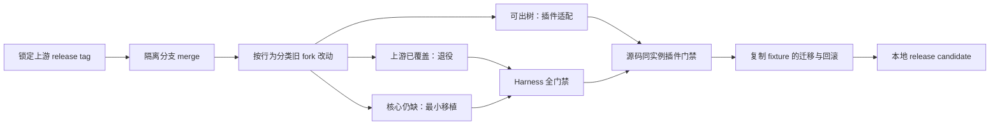

# 2026-09-09 — Harness `0.1.5-alpha.1` 基线升级与插件适配

## 目标与边界

本次把 Oh My DSH 使用的 Harness fork 从既有 fork HEAD 升到上游不可变 release `dsh-v0.1.5-alpha.1`，同时让 Desktop 与全部出树插件适配新运行时。升级在隔离 worktree 完成；不修改正式 Profile，不读写真实共享 Home，不发布 npm/GitHub/Desktop 产物。

核心原则是尽量少改 Harness：上游已经提供更强实现的能力直接退役 fork 补丁；能在插件边界修复的兼容问题留在插件；只有 shipped preset 内部既有 Provider、共享协议或核心响应契约无法被出树插件透明覆盖时，才保留最窄 Harness 修改。

## Harness 侧怎么改

### 1. 先按行为分类，不按旧 commit 机械重放

- **退役**：fork `PersistenceCoordinator` 被上游 `SessionWriteLease` 取代。lease 覆盖完整写句柄生命周期，强于旧的检查后 append 协调；恢复上游 persistence 包，不叠加旧 coordinator。
- **原样采用**：Session V3 migration、canonical envelope、`assistant/attempt`、system-message 固定头和 seq remap。不要为旧插件保留 V2 事件别名。
- **最小保留**：stock `BasicCompactionEngine.summarize()` 外的有界 hierarchy fallback、默认模型 effort 记忆串行化、MCP 状态事件、浏览器响应字节长度、`web:log` 信号退出语义、scoped client module 重发所有权、todo completion guard。
- **只生成**：Cordis catalog、module graph、config catalog、event matrix、subsystem pages 与双语 pairing sidecar。生成物不承载 fork 决策。

Hierarchy fallback 必须服从上游 compaction 事务：区域选择、稳定性检查、flush、持久替换、失败回滚和 Session V3 固定 system head 都由 stock 所有。`messages[0]` 固定头在每个 map/reduce 请求中恰好重放一次，并参与输入预算；其余消息才进入分块。

发布选包必须对不可变 tag 做 diff：`--upstream-ref dsh-v0.1.5-alpha.1` 决定包集合，`--base 0.1.5-alpha.1` 只校验 manifest 基线版本。禁止用移动的 `upstream/master` 作为发版输入。

### 2. 上游 release 自身的 gate 漂移只做窄修

- Node `fs.globSync` 会把 ACP 下指向 canonical Session snapshot 的 `system-prompt.expected.md` 文件软链误当目录；Markdown wrap gate 扫真实的 `sdk/session/web` snapshot family，两个 ACP alias 不重复扫描。
- `ui-conversation/skeleton/InputBar.tsx` 本来就是 skeleton 与 input domain 的组合视图；client-domain gate 只为该 package/file 声明 composite assembly point，其余 sibling-domain import 仍然失败。
- 新增跨 package type owner 时同步 TypeScript project reference、README companion 理由和 module graph，避免 `tsc -b` 把依赖源码纳入错误的 `rootDir`。

## 插件侧怎么改

### 1. 删除 `dsh-client-runtime/client` 聚合依赖

0.1.5 删除旧 client runtime owner。插件入口直接使用 `Context` from `@deepseek-ai/cordis`，再按实际服务显式导入声明所有者：

| 能力 | 0.1.5 类型/服务所有者 |
|---|---|
| `ctx.slots` | `@deepseek-ai/dsh-client-ui-renderer/client` |
| `ctx.sessions` | `@deepseek-ai/dsh-api-session-controller/client` |
| `ctx.uiWorkspace.startSession()` | `@deepseek-ai/dsh-client-ui-workspace/client` |
| `ctx.settingsScope` | `@deepseek-ai/dsh-client-ui-settings/client` |
| locale merge | `@deepseek-ai/dsh-client-locale/client` |
| Session identity | `@deepseek-ai/dsh-session/types` |

`dsh.client.inject` 是 browser module 装配依赖，插件导出的 `inject = [...]` 是 Cordis 服务权限与等待关系；两者都要与实际读取一致。`remote.settings` 等点号子服务仍须显式声明，不能依赖父 `remote` 推断。

### 2. 适配收紧的协议与 Session V3

- typed settings Remote 的 set op 现在要求 `JsonValue`。模型编辑器保留 draft 中未知 catalog 字段的开放类型，只在已通过 Host JSON/settings boundary 的 Remote 调用点收窄；不把浅 `isRecord` guard 伪装成递归 JSON 验证。
- Thread 与 todo guard 读取 `assistant/attempt`，不再读取退休的 assistant event。Session 日志通过 `snapshotEvents()` 获取。
- OhMyMemo 写工具从可信 `execution.agent.session.header` 取得 root session/cwd；缺 Agent、缺 header、存在 parent/origin 或 delegation depth 非零都 fail closed，不能信任调用参数模拟 root authority。
- Thread 创建目标会话后，在 pristine check 与首个 inbox mutation 之间写 `model/selection`，继承来源会话 `pending ?? lastUsed`；不要调用会改写全局默认的用户手势 API。

### 3. 避免与新版 stock 重复实现

- `dsh-compaction-hierarchical` 在检测到 stock basic 已声明全部 hierarchy 字段时，把配置原样交给 superclass，并完全委托其 fallback；旧 official basic 不具备这些字段时，才运行插件自带 map/reduce。否则一次 overflow 会触发双层 hierarchy。
- 兼容插件的源码测试必须让 superclass 使用 official baseline basic；其余 fork-modified 包仍链接适配 fork。`scripts/source-deps.mjs` 用逐插件例外表达这一点。
- Bridge 卸载只恢复自己确切写入的 rail template；若 React 或别的插件后来改写，后写者获胜。
- Send-while-running 用 CSS 仲裁 stock Stop 与 fallback Stop，不为这一显示问题新增 Harness slot。

### 4. 维护两种依赖姿态

- **源码验证态**：`pnpm run link:source` 动态发现所有 `plugin/dsh-*` 包和 Harness package owner，重写受管 devDependency 为 `link:`，先构建 Harness 生成 `lib/types`，再跑 `plugins:check`。任何未映射 `@deepseek-ai/*` 依赖立即失败。
- Desktop 的 runtime peer linker 先解析 assembled runtime 的 hoisted/pnpm layout；仅在这些入口缺失时扫描源码 checkout 的 `packages/` 与 `vendor/` manifest owner。不要假设 pnpm 会把 workspace 包 hoist 到 Harness 根 `node_modules/@deepseek-ai`。
- **提交候选态**：manifest 恢复 registry 坐标。未修改包使用官方 `0.1.5-alpha.1`；fork-modified 包保留 `@deepseek-ai/*` key，通过 npm alias 指向 `@crazx/*@0.1.5-alpha.1.zw.1`。fork 候选发布前可用 `pnpm run unlink:source -- --no-install` 只恢复 manifest；该模式不刷新 lockfile，也不构成 registry 验证。
- `@crazx` 候选包尚未发布时，只能完成 source-linked 与本地 package 验证；不得为了让 frozen install 假绿而保留 `link:` 或伪造 registry 包。发布后再补 registry/frozen-install gate。

## 验证顺序

1. Harness：frozen install、native build、`build`、聚焦测试、`doc-sync`、静态 graph/invariant/hygiene、全测试、snapshot/expected、immutable-ref publish list 与 dry-run。
2. 插件：全包 typecheck/test/build；检查 client bundle 只引用 0.1.5 平台模块；专项覆盖 Web Search assembly+guard、DOM 锚点、rail cleanup、Stop 仲裁、OhMyMemo authority 与 Thread model inheritance。
3. Profile：在临时 `DSH_HOME` 和隔离 OS Home/user-data 中执行真实 plugin install 事务、重复安装幂等、`--dump-config` 与 Host/Client bundle 启动。
4. Session：复制 V2 fixture 后运行 V2→V3；检查 system head、seq remap、Thread relation 与 OhMyMemo root authority。原 fixture 保持只读。
5. 回滚：恢复一份完整、未触碰的升级前 Home/Profile 副本。V3 migration 不承诺降级读取，不能把“旧二进制直接打开已迁移数据”写成回滚方案。

## 发版边界

本地 release candidate 可以包含提交、package list、tarball hash 与 dry-run 记录。push、tag、npm publish、GitHub Release、Desktop Release、正式 Profile 变更都需要单独授权。fork package 发布后，先完成 registry/frozen-install 和 packaged-profile smoke，再决定外部发布。
