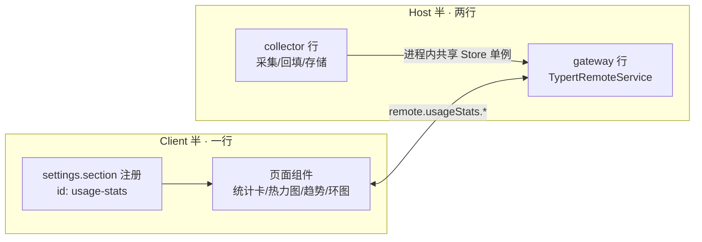

# 使用统计（Usage Stats）插件落地方案

2026-09-09 · 状态：设计定稿，待实施

目标：在设置里新增一级菜单「使用统计」，展示 Token 使用情况（总量/峰值/时长/连续天数）、Token 活动热力图、按 Provider 与模型的用量分布与每日趋势。参照截图（GLM CodingPlan 统计页）的信息架构。

## 核心判断（先看这三条）

1. **数据已经在 session 日志里，零 harness 改动。** `assistant/message` 事件（`packages/core/session/src/types.ts`）一条事件同时携带四要素：`usage: TokenUsage`（input/output/cacheRead/cacheWrite/reasoning，互斥口径）、`message.source.{provider,model}`（模型路由身份）、`time`（事件时间戳）。采集就是一个纯 fold，不动 agent loop、不动 adapter、不动 fork。
2. **两个现成的扩展点正好扣合需求。** UI 走 stock 设置域的 `settings.section` 槽（`ui-settings` 契约，list 槽，options 带 `id/order/label`，`ui-settings-models` 是注册范例）；client↔host 数据走 Typert Remote gateway（仓内 `dsh-web-search-toggle` 的成熟范式：`TypertRemoteService` + `@Remote` + `typert.host.ts`/`typert.remote-client.ts` 双半描述符）。本插件不需要发明任何新机制。
3. **回填也是现成的。** web bundle 默认挂 `session-query-sqlite`（`ctx.sessionQuery`：`listSessions()` + `listEvents(sessionId)`，live 优先、落盘可读），插件启动时全量 fold 一遍历史会话，按消息 id 去重，老数据立刻进统计——不需要等「从今天开始攒」。

## 复用能力清单（均已核对源码）

| 能力 | 位置 | 用法 |
|---|---|---|
| `session/event` 逐条追加 firehose | `packages/core/session` | `ctx.on('session/event', (session, event) => …)`，live 采集；回调直接拿到 event，无需自己 replay |
| `TokenUsage` / `ModelMessageSource` | `packages/llm/llm` | usage 五字段互斥（billed input = in+cr+cw）；source 给 provider/model |
| `ctx.sessionQuery` | `session-query-sqlite`（web bundle 已挂） | 冷回填：`listSessions()` → `listEvents(sid)` |
| `ctx.llm.listProviders()` | `packages/llm/llm` | provider id → 显示名 |
| `session/event` 的 scope 语义 | `dsh-scope` | profile/bundle 层行在根 scope，收全部会话（含子代理会话），token-meter 同款位置 |
| `settings.section` 槽 | `packages/client/ui-settings` | 一级设置页；`label: () => t('nav')`，locale 切换靠重注册 |
| Typert Remote 范式 | 仓内 `dsh-web-search-toggle` | gateway 服务 + 双半 typert 描述符 + `ctx.remote.$mount` |
| `$DSH_HOME/<dir>/` 持久化先例 | 仓内 `dsh-fs-observation-log` / `dsh-ohmymemo` | 插件私有目录、JSONL、原子 rename |
| locale 注册 | `dsh-client-locale` | `ctx.locale.register(NS, { zh, en })` 双语 |

## 采集点选型：A 为主，B 可选

| | A. `session/event` fold（推荐主线） | B. `llm/stream` waterfall 旁路 |
|---|---|---|
| 覆盖 | 会话对话流量（用户可见的每一轮模型调用） | 每一次流式调用，含压缩、标题生成等内部调用 |
| 能拿到 | usage + provider/model + time + **sessionId + turn/step** | usage + provider/model（`GenerateOptions`）；session 归属要靠 `markAgentLoopRequest` 进程内标记 |
| 支撑指标 | 全部五个卡片 + 热力图 + 趋势 + 环图 | 只有 token 量；算不了「最长聊天时长」和 per-session 维度 |
| 风险 | fork 种子消息重复（用 message.id 去重，见下） | retry 每次 attempt 都过 waterfall，但失败 attempt 无 usage chunk，不会重复计数 |

**结论**：v1 只做 A。B 留作 v2 增量（把内部调用记进独立 `source: 'internal'` 桶，UI 加「含内部调用」开关），不与 A 混账。

## 架构与数据流

```mermaid
sequenceDiagram
    autonumber
    participant Loop as agent-loop
    participant Log as Session 事件日志 (JSONL)
    participant Col as usage-stats collector (host)
    participant Store as $DSH_HOME/usage-stats/
    participant GW as Typert gateway (host)
    participant UI as 设置·使用统计页 (client)

    Loop->>Log: append assistant/message {usage, source, time}
    Log-->>Col: session/event(session, event)
    Col->>Col: 过滤 assistant/message + message.id 去重
    Col->>Store: 追加日滚 JSONL + 更新聚合快照(原子 rename)
    Note over Col,Store: 启动时先回填：sessionQuery.listSessions<br/>→ listEvents → 同一 fold
    UI->>GW: remote.usageStats.summary() / daily(range) / breakdown(dim)
    GW->>Store: 读聚合快照 + 必要时按日文件重算
    GW-->>UI: 聚合好的纯 JSON
```



## 存储设计（`$DSH_HOME/usage-stats/`）

```
usage-stats/
  records/2026-09-09.jsonl     # 日滚追加，一行一条 record
  aggregates.json              # 按日聚合快照（原子写：tmp+rename）
  state.json                   # 每 session 已消费 seq 水位 + 回填完成标记
```

- **record**：`{ t, sid, mid, provider, model, in, out, cr?, cw?, rt? }`（`mid` = message.id，去重键；`t` = event.time）。
- **去重**：fold 以 `mid` 为键。fork 会把源会话消息作为种子写进新会话日志（同一 message.id 再现），跨会话去重天然解决；live 与回填两通道共用同一去重表（state.json 持久化见过的 mid 集合，超上限转 Bloom/分片是后话，万级消息纯 Set 够用）。
- **聚合快照**：`{ days: { [date]: { total, peak, byProvider, byModel, sessions: { [sid]: { first, last } } } }, updatedAt }`。追加时增量更新；回填完成后整体重算一次。
- **并发**：桌面与终端共享 `$DSH_HOME` 时两个进程都在 append。JSONL 行级 append 基本安全（与 fs-observation-log 同一姿态）；aggregates.json 原子 rename、last-wins，与 AGENTS.md 的共享 Home 注记口径一致。不做跨进程锁（ohmymemo 的写锁是它自己的强一致性需求，统计场景读旧一秒无碍）。
- **retention**：records 默认保留 400 天（热力图一年 + 余量），聚合快照永久（体积极小）。配置项进 cordis.yml `config`，非法值 fail loud（仓规「无硬编码 tunable」）。

## Host 设计

**collector 行**（`dsh-usage-stats/collector`）：
- `ctx.on('session/event', …)`：只 fold `assistant/message` 且 `usage` 非空；`interrupted` 消息照常计入（token 已真实消耗）。
- 启动回填：`ctx.sessionQuery.listSessions()` → 逐个 `listEvents(sid)` → 同一 fold 函数。回填进度落 state.json，崩溃后续跑；回填期间 live 通道并行工作（去重键兜住交集）。
- `ctx.on('session/event')` 对 `session/disposed` 无需处理（数据已落盘）。

**gateway 行**（`dsh-usage-stats/gateway`，`TypertRemoteService`）：

```ts
class UsageStatsGateway extends TypertRemoteService {
  @Remote('summary')   // 五个卡片：totalTokens, peakTokens, longestChatMs,
                       // currentStreakDays, longestStreakDays
  @Remote('daily')     // { range: 7|30 } → 按日×模型序列（趋势图）
  @Remote('activity')  // { mode: 'daily'|'weekly'|'cumulative' } → 热力图格子
  @Remote('breakdown') // { dim: 'model'|'provider', range? } → 环图份额
}
```

- 返回全部聚合好的纯 JSON（RemoteResult 包装），client 不做 fold。
- provider 显示名在 gateway 侧用 `ctx.llm.listProviders()` 解析好再下发。
- typert 双半描述符照抄 wst 结构（host strict contribution + client remote contribution，zod schema 共享 wire shape）。

## Client 设计

- **挂载点**：`ctx.slots.register({ name: 'settings.section', id: 'usage-stats', order: 30, label: () => t('nav'), inject }, UsageStatsSection)`（models=10 之后、靠后站位）。`settings.general.item` 是单行偏好，不适合本需求，不用。
- **inject 面**：`{ summary/daily/activity/breakdown 四个查询 + refresh }`，组件不直接碰 remote（仓规：组件不做订阅机械，快照在 apply 世界取好注入）。v1 拉取策略：挂载时拉取 + 手动「刷新」按钮 + 窗口 focus 重校验；v2 可加 typert event 推送。
- **页面结构**（对齐截图信息架构）：
  1. 统计卡 ×5：累计 Token / 峰值 Token（单次调用 total 最大值）/ 最长聊天时长 / 当前连续天数 / 最长连续天数。
  2. Token 活动热力图（每日/每周/累计 tab，GitHub 风格格子，7 行 × N 列）。
  3. 时间范围切换（近 7 日 / 近 30 日）作用于趋势图与环图。
  4. 每日 Token 趋势：按模型分色折线（平滑曲线）。
  5. 模型 / Provider 用量环图：dim tab 切换，份额 + 绝对值列表。
- **图表**：平台模块表里没有图表库，引入第三方库会撞 client bundle 纯度门。**手写 SVG**（热力图=rect 网格、折线=path+catmull-rom、环图=stroke-dasharray circle），三图都是百行级 SVG 组件。样式只用 `--dsw-*` 语义 token + CSS Modules；手写 `<style>` 若有，必须预打 `data-plugin`/`data-plugin-css` 标记（2026-09-08 HMR 误删事故教训，AGENTS.md 已收录）。
- **locale**：`ctx.locale.register('usage-stats', { zh, en })`，中文优先。
- **数字格式**：万单位（`6852.8万`）在 client 侧格式化，gateway 下发生原始整数。

## 指标口径（先定义死，避免 UI 扯皮）

| 指标 | 口径 |
|---|---|
| 累计 Token | Σ 每条 record 的 (in+cr+cw+out)，全时段 |
| 峰值 Token | max 单次调用 total |
| 最长聊天时长 | 单会话 max(last−first event time)，取自聚合快照的 sessions 桶；跨天会话按整段计 |
| 当前连续天数 | 从今天（本地时区）向前逐日有 record 的天数 |
| 最长连续天数 | 历史最长连续有 record 日序列 |
| 热力图 | 日 total → 5 档色阶；weekly=按周汇总；cumulative=累计曲线式填色 |
| 趋势/环图 | range 内按 model / provider 分组求和 |

已知边界（写进 README，不藏）：adapter 不上报 usage 的调用不进统计（记录在 record 里标 `estimated` 是 v2 项）；失败/取消的调用无 usage 不计入；压缩/标题等内部调用 v1 不计入（见采集点选型）。

## 落地步骤

脚手架起插件（仓规强制，不手搓 manifest）：

```sh
pnpm run plugin:new -- dsh-usage-stats --face dual --description "设置·使用统计：Token 用量、Provider/模型分布与活动热力图"
```

- **M1 host 先行**：collector + store + 回填 + gateway，无 UI。验证：scratch home 起 `dsh web`，跑几轮会话后 curl Remote 端点（或临时 host 日志）核对数字与 session 日志手工 fold 一致。
- **M2 client**：settings.section + 五卡片 + 热力图 + 趋势 + 环图 + 双语。验证：scratch home 实机挂载（`dsh plugin --profile web add`），对照截图走查。
- **M3 收尾**：retention 配置、回填进度展示、桌面 owned 与否决策（`dsh.desktop.ship` 暂不标，先走 git tag 分发）、README + 本笔记收口。

## 明确不做

- 不改 harness/fork 任何一行（纯 out-of-tree 插件）。
- 不做费用估算（无价格表事实源，做了就是编造）。
- v1 不接 `llm/stream` 内部调用、不做 per-session 下钻页、不做导出。
