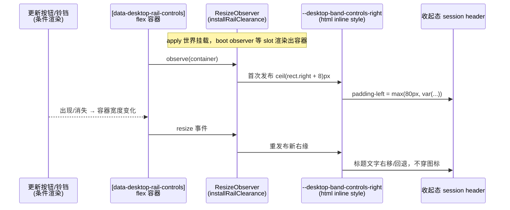

# 收起态会话标题避让 rail 控件实测宽度（bridge 0.2.0-rc.14）

> **⚠️ 已撤销、未发布**：本方案（动态测量 + CSS 变量避让）随 rc.14 首版实施后即被**统一 toolbar** 方案整体取代——补丁链（overlay 控件 + 测量避让）的根因是布局层级错误，正确修法是把工具栏做成真实布局行。见 `docs/notes/2026-09-10-unified-shell-toolbar.md`（其中「旧代码处置」一节删除了本方案引入的 `installRailClearance`/`RAIL_CLEARANCE_VAR`/动态 padding 及其测试）。bridge 0.2.0-rc.14 版本号保留、语义重写为 toolbar 版；本方案从未随任何桌面 Release 分发。以下正文仅作历史记录。

2026-09-10 · 修复 rc.12「内容顶到窗口上沿」设计缺口 · 状态：**已实施（bridge 0.2.0-rc.14，含文末评审修订），随桌面 0.3.0-rc.45 与当日其他改动合并发版**

## 根因（实机踩中的已知设计缺口）

rc.12 起中间栏内容顶到 y=0，session header 进入顶部带做 macOS 工具栏式布局。收起侧栏时，设计只给 `[data-slot="conversation.session.header"]` 加了 `padding-left:80px`——按 `docs/notes/2026-09-09-band-content-top-design.md`，这 80px 的意图是**让出红绿灯**（x≈16–70），与 rail 控件 `left:86px` 同标线。

但 rail 控件本身也占着这条带：常驻 toggle + 条件出现的更新按钮、通知铃铛、收起态才有的「＋新会话」气泡，从 x≈86 起一直向右延伸（实机约到 x≈350）。标题文字从 x=80 起排，正好从 rail 控件们的**底下穿过去**——「实现 dsh-usage-stats 使用统…」被 🗖 ⊖ ⊕ 三个图标压住的现象。控件是透明底图标而非遮挡块，所以读起来像「顶部挡住了文字」。

一句话：**收起态的避让量只算了红绿灯，没算 rail 控件的实际占用宽度**。而 rail 控件宽度是动态的（更新按钮、铃铛按状态出现/消失），任何固定值都不靠谱。

## 方案：动态测量 + CSS 变量（测量闭环在桥插件包内）

桥插件自己渲染 rail 控件、自己注入避让 CSS，两边同包，无跨插件耦合。

### 1. 发布变量（`rail.ts` `installRailClearance`，apply 世界）

对 `[data-desktop-rail-controls]` 容器挂 `ResizeObserver`，每次变化写文档级变量：

```ts
document.documentElement.style.setProperty(
  '--desktop-band-controls-right',
  `${Math.ceil(el.getBoundingClientRect().right + 8)}px`,  // 右缘 + 8px 呼吸
)
```

- frame 在视口原点，`rect.right` 直接可用作 header 的 `padding-left` 值。
- 容器尺寸随更新按钮/铃铛/新会话气泡的出现消失变化，RO 全覆盖；新会话气泡是 `visibility` 过渡（占位不消失），收起/展开切换不产生宽度跳变。
- 遵守仓内约定：**组件不做订阅机械**，测量放 apply/effect 世界（`index.ts` 的 titlebar-fusion effect 组）。
- slot 渲染时机不确定（`slots.inject` 等 ui-layout 声明），与 `installRailHider` 同款 boot MutationObserver 等容器出现。
- effect 反注册时 disconnect 并 `removeProperty`，变量不泄漏到下一次挂载。
- fail-soft：RO/MO 缺席时安装器整体 no-op，变量保持未设。

### 2. 消费变量（`titlebar.ts` 一处规则）

```css
div[data-sidebar-collapsed]:has(> [data-shell-overlay])
  [data-slot="conversation.session.header"]{
    padding-left:max(80px, var(--desktop-band-controls-right, 80px));
  }
```

- `max()` 以 80px 灯排为下限；`var()` 兜底 80px——首次测量前、或 rail 控件因故缺席时，退化为现状（至少让开灯排）。
- 变量名 `RAIL_CLEARANCE_VAR` 常量住 `rail.ts`（发布方），`titlebar.ts` import 同一常量，两处不会漂移。
- 展开态不加规则：中间栏 x≥280，rail 控件（不含新会话气泡只到 x≈190）天然不撞，维持现状。
- WKWebView 对 `max()`/`var()` 的支持远早于本仓支持的最老内核。

### 测量闭环



## 测试

- `tests/titlebar.test.ts`：收起态规则钉住 `padding-left:max(80px, var(--desktop-band-controls-right, 80px))` 字面形态，并断言旧的固定 `padding-left:80px` 不复存在。
- `tests/rail.test.ts`：`railClearanceValue`（右缘+呼吸、小数向上取整、变量名）；`installRailClearance` wiring（发布初值、RO 回调重发布、dispose 移除变量并断开、boot observer 等容器出现、无 observer 支持 no-op）。

## 实机验收清单（接 `docs/notes/2026-09-09-band-content-top-design.md` 验收清单第 2 条扩写）

1. 收起态：标题/页签整体位于 rail 控件右侧，长标题正常 ellipsis，不与任何图标相交；
2. 有更新可用时（多一个下载钮）标题自动再右移；通知铃铛出现/消失时同样自适应；
3. rail 控件四个按钮悬停/点击正常（拖拽条挖洞逻辑不受影响，本次不改 drag-strip）；
4. 展开态、右栏 push/float/fullscreen、hero 空态全部回归现状不变。

## 备选与否决理由

- **静态最坏值**（80px → ≈360px）：一行改完，但无更新/无铃铛时标题栏左侧永久空一大块，窄窗下标题几乎被挤没，控件将来加宽又会撞。否决。
- **回退收起态顶上去**（收起时中间栏恢复 28px 下压）：把 rc.12 刚消灭的空带请回来，方向性倒退。否决。

## 发版

- bridge `0.2.0-rc.13` → `0.2.0-rc.14`（desktop-owned 随包清单）。
- 桌面 `0.3.0-rc.44` → `0.3.0-rc.45`：bump 仓根 `package.json`、CHANGELOG 补 `[0.3.0-rc.45]` 小节、推 `v0.3.0-rc.45` tag。

## 修订（评审 P2）：observer 必须跟随 slot 重声明替换节点

**起因**：首版 `installRailClearance` 首次找到容器后即断开 boot observer，RO 回调闭包永久捕获首个 `el`。但 `shell.overlay` 的 slot owner redeclare/remount（ui-layout HMR、服务生命周期重建）会卸载旧 `DesktopRailControls`、挂载新节点，而 clearance effect 仍在——观察者钉死在已脱离文档的旧节点上：要么旧节点 rect 归零写出自欺的 `8px`（被 `max()` 压回 80px），要么不再触发、变量停留在旧宽度，新节点的宽度变化无人观察。两种情况收起态标题都会重新压图标，直到 bridge 重载或整页刷新。

**修法**（`rail.ts` 同函数内重写）：

- child-list `MutationObserver` 保持**整个 effect 生命周期**，不再一次性 boot；
- 每次 reconcile 比较 selector 当前节点与已观察节点：替换即 disconnect 旧 RO、绑定当前节点并立即重发布；
- 节点暂时缺席（unmount → remount 之间）移除变量，消费规则回落 80px 下限，绝不信任陈旧右缘；
- dispose 统一断开 MO + RO 并清变量；
- 测试补「已 attach 节点被新节点替换、随后新节点 resize 仍被跟随」与「节点缺席期间变量被移除」两条用例，并把「boot observer attach 后断开」的旧断言翻转为「watch observer 持续存活」。
