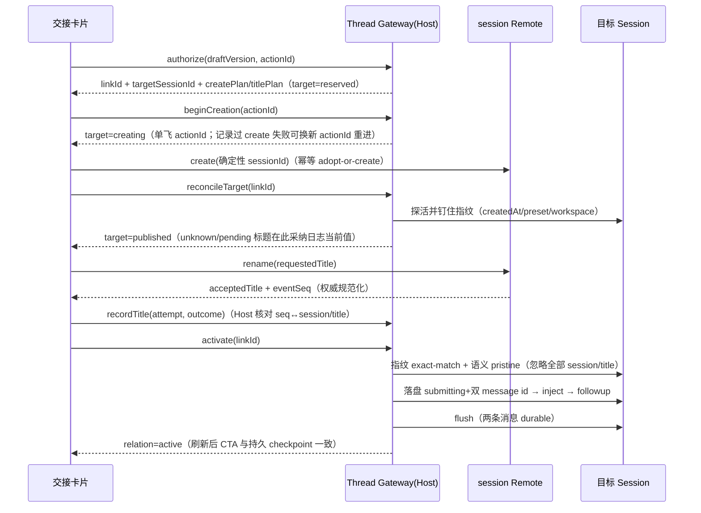

# Thread 交接 Saga 拆分为正交 checkpoint：标题契约、目标指纹与真实恢复动作

日期：2026-09-10 · 包：`dsh-thread` 0.3.0-rc.1 · 关联事故：82-byte 标题改名后被判「不 pristine」导致交接卡死

## 事故与根因

一次 Thread 交接的目标标题超过部署的 `maxTitleBytes`（默认 80 bytes）。上游 `session.rename` 按契约返回了规范化后的 `{ title, seq }`，但 Thread 只取了 `rename.ok`，把原始标题继续当作「目标必须等于」的事实：activation 的 pristine 检查要求目标日志首个 `session/title` 事件严格等于原始标题，截断后必然不等，Link 永久停在 `failed`；UI 的「重试」走 `advanceCreation`，而 `failed → creating` 根本不被接受，用户必然得到 `cas-failed`。

评审结论：这不是「缺一次 normalize」，而是**一个总状态枚举混合了授权、发布、标题处理、消息投递四件事**，且**把展示性标题误用作目标身份与 pristine 安全边界**。补标题截断仍会留下配置漂移、崩溃恢复、失败重试与多窗口竞态。

## 0.3.0 的根治模型

Link 持久状态拆为四组正交、可独立恢复的字段 + 结构化失败：

```ts
target:   { phase: 'reserved'|'creating'|'published'|'diverged'|'abandoned',
            fingerprint: { createdAt, agentPreset, workspaceId, cwd } | null }
title:    { phase: 'not-requested'|'pending'|'accepted'|'failed'|'unknown',
            requested, accepted, eventSeq, failure }
delivery: { phase: 'prepared'|'submitting'|'flushed'|'uncertain',
            attempt, handoffId, instructionId }
relation: 'pending'|'active'|'abandoned'
failure:  { phase: 'authorize'|'create'|'title'|'activate'|'flush',
            code, recovery: 'resume'|'reconcile'|'clone'|'open-target'|'none', detail }
```

最终原则：**目标指纹负责身份，语义事件负责 pristine，Session Title 服务负责标题规范化，Saga checkpoint 负责恢复，UI 只暴露真实可执行的恢复动作。**

### 标题契约

- `requested` 只用于审计与用户意图展示；wire 层按字符数限界（200），永不按字节截断——82-byte 标题原样穿过。
- `accepted` + `eventSeq` 只来自 rename 成功响应或对账时采纳目标日志当前 `session/title`；Thread 绝不自拷上游 80-byte 规则（`maxTitleBytes` 可按部署配置漂移）。
- `recordTitle` 从 `{ ok: boolean }` 改为判别联合 outcome（accepted/failed/unknown）并绑定发起 rename 的 creation attempt；Host 对 accepted 核对目标日志指定 `seq` 确实是对应 `session/title` 事件，不盲信 Client。
- rename 失败或响应未知只影响 `title.phase`，不阻止交接；**不自动重试 unknown 的 rename**（避免重复追加标题事件），由 reconcile 采纳目标当前标题。
- pristine 检查忽略一切 `session/title` 事件——标题是 log-only 展示元数据，不进模型上下文，也不能当身份凭证。

### 目标身份与语义 pristine

- 身份由指纹决定：`targetSessionId` 等于 Link 预分配 ID、`createdAt ≥ authorization.createdAt`、`agentPreset` 等于授权钉住的 preset、workspace/cwd 与 create plan 一致；首次 reconcile 钉住，后续 exact match，失配 → `diverged` + `recovery: 'clone'`。
- pristine 只看会改变模型执行语义的事件：外来 `user/message`、turn、assistant/tool/command、非本 Link 的 inbox mutation 判 `diverged`（**diverged 永不再注入**）；本 Link 已落盘消息（按持久化的 message id）与其下游回合事件豁免；`model/selection` 等结构事件允许。
- 上游 `session.create` 带显式 sessionId 时是幂等 adopt-or-create（冷会话按 ID resume、校验 cwd/preset）——「creating 结果未知」的对账就是重发同 ID create，多窗口/重放不可能造出重复 Session。

### 投递 checkpoint 与崩溃恢复

activate 的关键顺序：先构造两条消息（纯构造即铸 id）→ **先把 `submitting` + 双 message id 落盘** → 模型继承 append + inject/followup（同步无 await）→ flush → `relation: active` 仅在两条消息都 durable 后提交。每个崩溃窗口由此可判定：日志里有双 id → 直接补提交；缺谁 → 只用新 id 重投谁；flush 结果未知 → `uncertain`，用户确认后 redeliver（自检在场，绝不重复）。临时性失败（not-live/not-idle）不落失败记录。



### UI 恢复动作（假「重试」已删除）

| 持久 checkpoint | 卡片动作 |
|---|---|
| `reserved` | 继续创建 / 取消授权 |
| `creating`（结果未知或记录过 create 失败） | 重新检查（对账；终端冲突 → 克隆到新会话） |
| `published` 语义 pristine | 启动交接（标题 pending 才会 rename） |
| `published` 已 diverged | 打开已创建会话 / 克隆到新会话（永不注入） |
| title `failed/unknown` | 仅显示标题警告，不阻断启动交接 |
| delivery `uncertain` | 重新投递（两段确认 + 风险说明；自检只补缺失消息） |
| relation `active` | 打开 Thread 会话 |

CAS 类错误（`cas-failed`/`creation-in-flight`/`link-not-found`）由 Client 自动重读 Link 再按最新 checkpoint 渲染，用户只看到「状态已更新」，永不见内部码。

### 存量记录迁移

迁移在 zod parse 边界（`z.preprocess(migrateLegacyLink, …)`）完成、boot 时一次性清 `legacy` capture 重写落盘，`dsh_thread` domain 不 bump version（bump 会让 medium 拒开而不是迁移）：

- 事故形态（`failed` + `target-not-pristine` + offending 为 `session/title[-unexpected]`）→ `published` + title `unknown`（等待采纳与再确认 activation）；语义 offending 保守落 `creating` 走对账，再 activation 重查 purity 自然暴露真实 diverged。
- `active` → published+flushed+active；`uncertain` → delivery uncertain（flush/resume）；`activating` → submitting 自愈。
- 迁移绝不自动唤醒 Agent、不自动投递；diverged 记录保留普通 Session 并提供克隆（新 Draft/Link/target ID）。

## 落点与验证

- 代码：`plugin/dsh-thread/src/thread-types.ts`（新 schema+不变量：active ⟺ flushed ⟺ commit ⟺ published）、`migrate.ts`、`purity.ts`、`recovery.ts`、`identity.ts`（advanceCreation 重进规则）、`gateway.ts`（authorize/beginCreation/reconcileTarget/recordTitle/activate/cloneDraft/abandon）、`client/index.tsx`（恢复动作驱动）、`domain.ts`、`typert.remote-client.ts`（新增 reconcileTarget/cloneDraft/abandon 描述符）。
- 顺带修复：上游 0.1.5-alpha.1 的 `Session.snapshotEvents()` 已是 `events` getter——rc.7 源码对当前依赖根本过不了 typecheck，本次一并对齐（gateway 5 处调用点）。
- 测试（64 项全过）：82-byte 标题 wire 回归（字符界、非字节）、recordTitle 判别联合与 attempt 绑定、每个 legacy state 的迁移断言（含事故记录 → published+unknown）、purity（任意数量 session/title 永不违规、外来语义事件 diverge、本 Link 消息与下游回合豁免、部分落盘按 id 判定）、恢复动作表、advanceCreation 重进/单飞/abandoned、relation 不变量。
- E2E 门槛（真机验收时执行）：authorize/begin/create/reconcile/rename/inject/flush/relation 每个边界模拟崩溃并验证恢复；多窗口同 Draft 点击不重复建 Session；diverged 永不注入；刷新后 CTA 与持久 checkpoint 一致；含 82-byte 标题回归。

## 发版

- 插件 `dsh-thread` 0.2.0-rc.7 → **0.3.0-rc.1**（持久 schema 语义重排，minor+rc），tag `dsh-thread-v0.3.0-rc.1`，ship pin 同步。
- Thread 是 desktop-owned：桌面侧需按 AGENTS.md「发版」在下一个桌面 release（root bump + `v*` tag + prepare manifest 记录 threadTarball/threadVersion）一并带出，不单独提前发桌面版。
